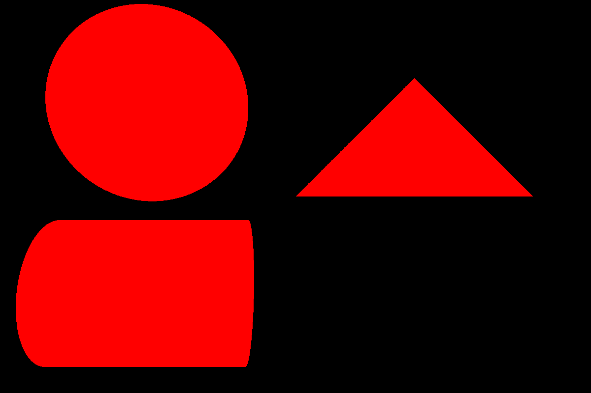
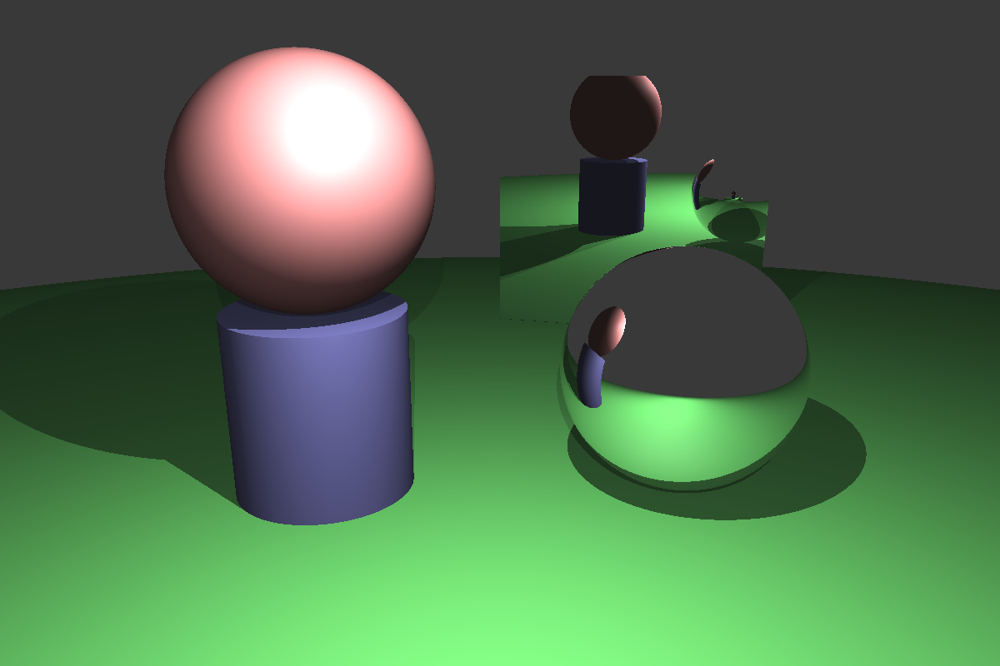
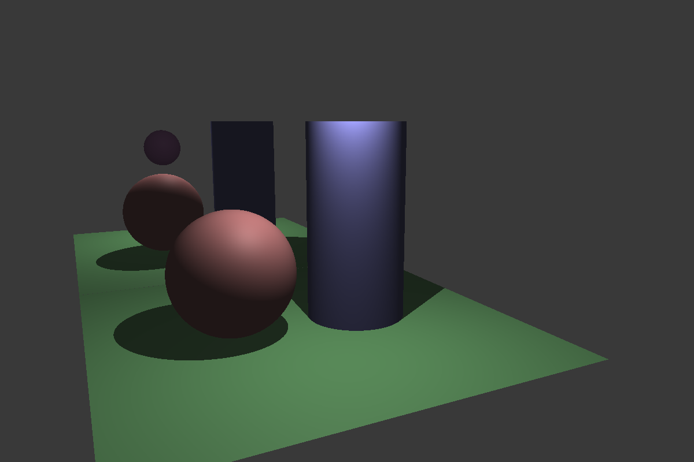
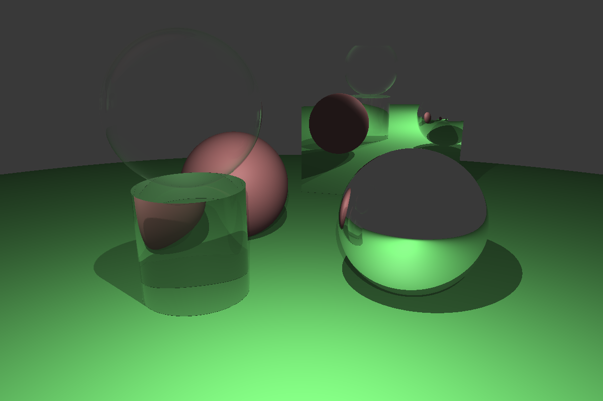
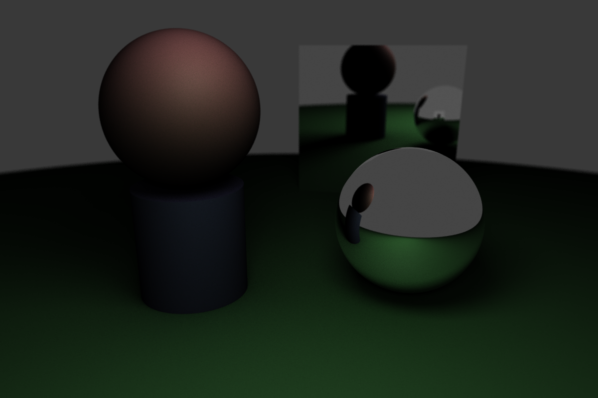
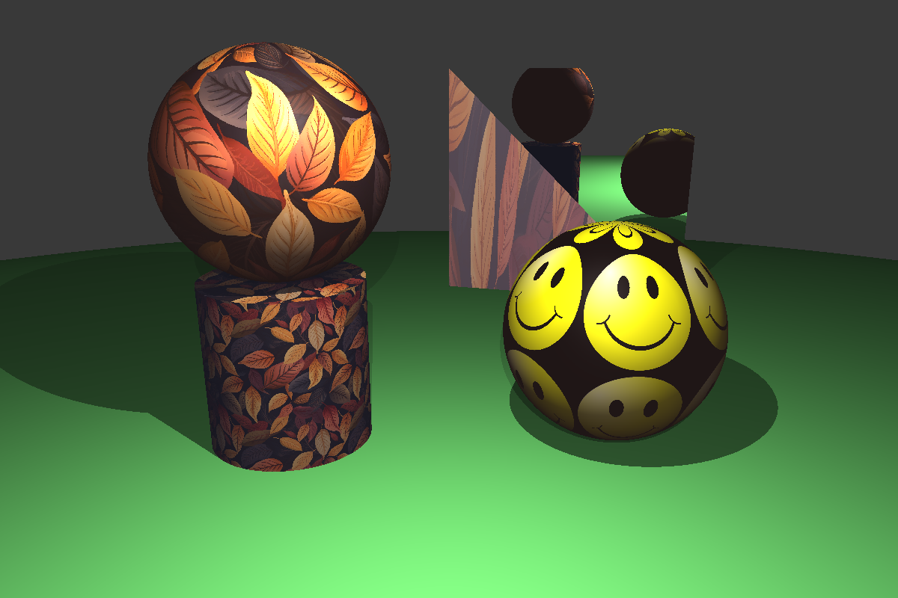
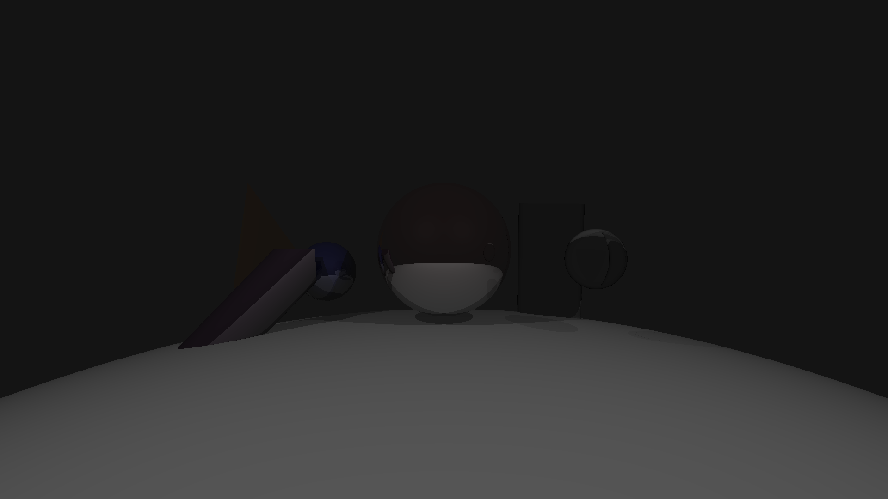

# C++ Path Tracer

A CPU ray tracer and path tracer written in C++17. Parses JSON scene descriptions and renders PPM images with support for BVH acceleration, PBR materials via GGX microfacet BRDFs, Monte Carlo path tracing, and multiple tone mappers.

[](https://isocpp.org/std/the-standard)
[](https://cmake.org/)
[](LICENSE)

## Sample Renders

| Binary | Phong | Reflection |
|:---:|:---:|:---:|
|  |  |  |

| Refraction | Path Tracing | Texture | BVH |
|:---:|:---:|:---:|:---:|
|  |  |  |  |

## Features

### Ray Tracer

- **Three render modes**: binary (hit/miss), Blinn-Phong shading, and Monte Carlo path tracing
- **Geometry primitives**: sphere, triangle, cylinder with analytic intersection tests
- **Blinn-Phong shading**: ambient, diffuse, and specular components with configurable light intensity
- **Shadows**: hard shadow rays from point lights
- **Reflection**: recursive mirror reflections with configurable bounce depth
- **Refraction**: Snell's law refraction with Schlick's approximation for Fresnel terms
- **Textures**: PPM texture mapping on all primitive types, with UV coordinates and tile factors
- **BVH acceleration**: AABB bounding volume hierarchy with Surface Area Heuristic (SAH) splitting. Toggleable via scene JSON
- **Tone mapping**: four methods: linear, Reinhard, filmic, and luminance-based scaling. Configurable exposure
- **Image output**: PPM P3 format

### Path Tracer

- **Multi-bounce path tracing**: recursive Monte Carlo integration with configurable bounce depth
- **PBR materials**: Lambert diffuse combined with GGX microfacet specular (FancyBRDF), with roughness and metalness parameters
- **Anti-aliasing**: per-pixel multi-sampling with three strategies: random, jittered grid, and Poisson disk
- **Depth of field**: finite aperture camera with defocus blur, configurable aperture size and focus distance
- **Soft shadows**: rectangular area lights sampled with configurable sample count
- **Russian Roulette**: stochastic path termination (configurable probability) to cap computation at higher bounce depths

## Build & Run

Requirements: CMake 3.10+ and a C++17 compiler (g++ or clang++).

```bash
git clone https://github.com/JinBa1/cpp-path-tracer.git
cd cpp-path-tracer
mkdir build && cd build
cmake .. && make
```

Run a scene (you must run from the `build/` directory since paths in JSON files are relative):

```bash
cd build
./ray_tracer ../data/jsons/scene.json ../output/ my_render
```

The first argument is the JSON scene file. The second and third are the output directory and filename (optional, defaults to `rendered` in the current directory). Output is written as a `.ppm` file.

## Scene Format

Scenes are described in JSON. Here is a minimal example:

```json
{
    "rendermode": "phong",
    "useBVH": true,
    "camera": {
        "width": 800,
        "height": 800,
        "position": [0, 1, 3],
        "lookAt": [0, 0, -1],
        "upVector": [0, 1, 0],
        "fov": 60,
        "toneMapper": "reinhard",
        "exposure": 0.1,
        "samples_per_pixel": 4,
        "aperture": 0.02,
        "focus_dist": 1.5
    },
    "scene": {
        "ambient_light": [0.25, 0.25, 0.25],
        "background": [0.2, 0.3, 0.5],
        "lightsources": [
            { "type": "pointlight", "position": [5, 5, 5], "intensity": [1, 1, 1] }
        ],
        "shapes": [
            {
                "type": "sphere",
                "centre": [0, 0, -1],
                "radius": 1.0,
                "material": {
                    "diffuse_color": [0.8, 0.3, 0.3],
                    "specular_color": [1, 1, 1],
                    "shininess": 32,
                    "reflectivity": 0.0,
                    "transmittance": 0.0,
                    "ior": 1.5
                }
            }
        ]
    }
}
```

Key fields:

| Field | Values | Default | Notes |
|-------|--------|---------|-------|
| `rendermode` | `binary`, `phong`, `path` | `path` | Selects the rendering algorithm |
| `useBVH` | `true`, `false` | `true` | Toggles BVH acceleration |
| `toneMapper` | `linear`, `reinhard`, `filmic`, `luminance` | `luminance` | HDR to LDR conversion method |
| `samples_per_pixel` | integer | `1` | Anti-aliasing sample count (path mode) |
| `sampling_method` | `random`, `jittered`, `poisson_disk` | `poisson_disk` | Pixel sampling strategy |
| `allowBRDF` | `true`, `false` | `false` | Enables PBR microfacet shading (path mode) |
| `RR_PROB` | 0.0 to 1.0 | `0.8` | Russian Roulette termination probability |
| `aperture` | float | `0.02` | Lens aperture for depth of field |
| `focus_dist` | float | `1.5` | Focal plane distance |

Shape materials support an optional `texture` field pointing to a PPM file, plus `has_brdf`, `roughness`, `metalness`, and `base_color` for PBR rendering.

Rectangular area lights use `type: "rectlight"` with `u`, `v`, `width`, `height`, and `num_samples` fields.

## Render Modes

| Mode | Description | Output |
|------|-------------|--------|
| `binary` | Casts a single ray per pixel. White if the ray hits geometry, black otherwise. Fast diagnostic mode. | Black and white silhouette |
| `phong` | Blinn-Phong shading with shadow rays, recursive reflection, and refraction via Schlick's approximation. Configurable bounce depth. | Lit scene with highlights, shadows, mirrors, and glass |
| `path` | Monte Carlo path tracing. Each pixel sends multiple samples, bouncing through the scene with BRDF importance sampling. Russian Roulette terminates paths stochastically. | Physically-based global illumination with soft shadows and indirect lighting |

## Test Suite

A smoke test builds the project and renders all scenes in `TestSuite/`:

```bash
bash scripts/smoke_test.sh
```

This compiles the project, runs each JSON scene through the renderer, and checks that valid PPM output files are produced. Scenes that time out (120s limit) or produce missing/empty output are reported as failures.

## Architecture Overview

The codebase uses a header-heavy architecture where most implementation lives in `.h` files. Only four modules have separate `.cpp` files (Camera, Node, ObjectList, ImageWriter).

```
include/
  Camera.h          — Ray generation, render dispatch, tone mapping, all trace functions
  Parser.h          — Header-only JSON scene parser (nlohmann/json)
  Material.h        — Material data struct, texture loading, GGX helpers
  ImageWriter.h     — PPM P3 file writer
  object/
    Object.h        — Abstract base class (intersect, bounding_box)
    Sphere.h        — Analytic sphere intersection
    Triangle.h      — Moller-Trumbore ray-triangle test
    Cylinder.h      — Finite cylinder intersection
    ObjectList.h    — Scene geometry collection, BVH entry point
  bvh/
    BoundingBox.h   — AABB with ray-axis slab test
    Node.h          — BVH node, 3 split strategies (SAH active)
  brdf/
    BRDF.h          — Abstract BRDF (Evaluate, Sample)
    Lambert.h       — Lambertian diffuse
    Microfacet.h    — GGX NDF, Smith G, Fresnel-Schlick
    FancyBRDF.h     — Combined Lambert + Microfacet PBR material
  light/
    Light.h         — Abstract light (phong_shading, brdf_shading)
    PointLight.h    — Point light with shadow rays
    RectangularLight.h — Area light with stratified sampling
    LightList.h     — Light collection
  util/
    Vector3.h       — Core math: Vector3, Point3, Radiance aliases
    Ray.h           — Ray origin + direction
    Radiance.h      — Tone mapping functions
    Interval.h      — Min/max interval for ray parameter bounds
    Utilities.h     — Enums, constants, RNG, math helpers
```

## Performance

All timings from a single-threaded run on an 800x800 image, compiled with `-O1`:

| Scene | Mode | Samples | BVH | Time |
|-------|------|---------|-----|------|
| `binary_primitives` | Binary | 1 | On | 0.19s |
| `phong_scene` | Phong | 1 | On | 0.33s |
| `path_scene` | Path | 20 | On | 37.31s |

Timed with `std::chrono::high_resolution_clock` on the render phase only (excludes scene parsing and BVH construction). Hardware: single-threaded, GCC 13.3, Linux x86_64.

## Dependencies

| Dependency | Version | Notes |
|------------|---------|-------|
| CMake | 3.10+ | Build system |
| C++ compiler | C++17 | g++ or clang++ |
| nlohmann/json | 3.11.3 | Vendored in `include/json.hpp` |

No external libraries need to be installed. The JSON parser header is included in the repository.

## License

This project is licensed under the [MIT License](LICENSE).
